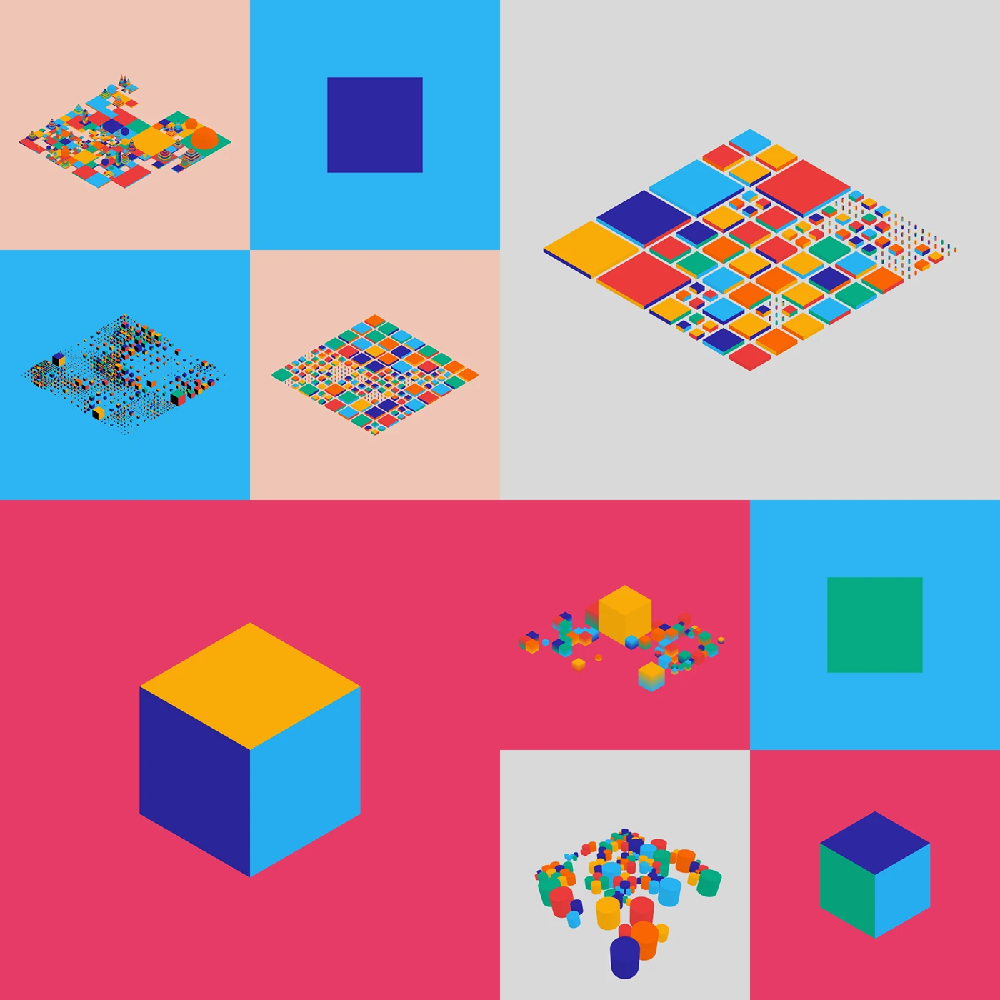
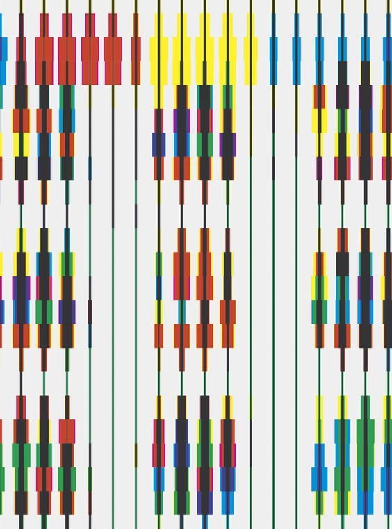

# Broadway Boogie Woogie In Motion - Interactive Audio Visualizer
Individual Project – Osacr Lee (clee0475). Based on the group project inspired by Piet Mondrian’s “Broadway Boogie Woogie”.

---

## How to Interact with the Work

1. **Load the Page**: The visualization will initialize automatically, displaying a grid-based city layout with moving traffic and buildings.

2. **Play Audio**: Click the **"Play Audio"** button to start the music (501 Boogie). The city will come alive with synchronized visual effects.

3. **Toggle Day/Night Mode**: Click the **"Night Mode"** button to switch between day (Mondrian-inspired primary colors) and night (synthwave neon palette) color schemes.

4. **Switch Views**: Click the **"3D Mode"** button to toggle between 2D top-down and 3D isometric perspectives. The city transforms dynamically when switching views.

5. **Best Experience**: Try different combinations to see different aesthetic interpretations.

---

## Individual Approach to Animation: Audio Reactivity

I chose **audio analysis** as the primary driver for my animation. The visualization responds to real-time frequency spectrum data and amplitude levels from the music track, creating a synchronized audio-visual experience.

### Animated Properties

My implementation animates multiple interconnected properties:

1. **Traffic Cubes (Cars)**:
   - **Size/Scale**: Each car reacts to specific frequency bands (50-400 Hz), scaling between 1.0x and 3.5x based on audio intensity
   - **Motion Trails**: Cars leave glowing trails when audio is playing
   - **Behavior Change**: In 2D mode, cars are highly reactive with trails; in 3D mode, they maintain constant size and no trails for performance

2. **Buildings (Blocks)**:
   - **Height**: Buildings grow vertically based on frequency spectrum analysis (0-350 units), with each building assigned a unique frequency band (mapped from index 0-25 to spectrum 350-0)
   - **Pulse**: Buildings pulse in size (±60%) based on overall amplitude
   - **State Persistence**: When audio pauses, buildings hold their current height (new behavior - they don't shrink back to zero)

3. **Visual Effects**:
   - **Glow/Bloom**: In 2D mode, WEBGL lighting creates a neon glow effect around moving cars
   - **Layering**: Draw order changes to create a more aesthetically pleasing work. When playing, roads render on top (cars glow underneath); when paused, cars render on top

### Unique Differentiation from Group Members

While my group members may focus on Perlin noise and user interaction, my approach is distinctly **frequency-selective and spatially distributed**:

- **Frequency Mapping**: Each visual element responds to different parts of the audio spectrum, creating a spatially distributed frequency visualization across the city
- **Dual-Mode Behavior**: The same code produces dramatically different visual results in 2D vs 3D, with intentional performance optimizations (trails disabled in 3D, reduced update rates)

---

## Inspiration and References

### Why Audio?

Inspired by both the **geometric grid of the Manhattan street system** and the **syncopated rhythms of boogie-woogie jazz music**, the painting is composed of segments of bright primary colors that form a pulsing grid. The densely packed, "blinking" blocks of red, yellow, and blue create a vibrant, optical vibration that visually captures the dynamic energy of New York City and the rhythmic complexity of its soundtrack. Mondrian's connection to music gave my work conceptual legitimacy. I'm not just adding audio to a static image, I'm continuing a historical tradition of music-driven visual abstraction. His use of NYC's grid as both structure and subject validated my "city as stage for audio performance" approach.

> Inspiratoin 1: Reference This Mondrian painting is actually a jazz score. [Source Link](https://www.youtube.com/watch?v=05KLW-xsoxE)

### Visual Inspiration

Visually, the isometric city reference inspired my 3D implementation. It showed that simple extruded boxes can create compelling architectural visualizations when viewed from the right angle. This led to buildings growing vertically (like frequency bars) rather than pulsing radially.

 
> Inspiratoin 2: Semi-3D cityscape with various shapes and colors. [Source Link](https://www.behance.net/gallery/61837719/PROCESSS-01)

Also, this image below inspired my 2D mode traffic system, with colored cubes (cars) sliding along the grid lines (roads), creating a living, breathing version of Mondrian's static composition. The syncopated rhythm of different-sized, different-colored blocks moving at varying speeds recreates the visual "beat" Mondrian captured in paint.


> Inspiratoin 3: 2D traffic visual. [Source Link](https://pin.it/4Utg37P26)

---

## Technical Explanation

### Core Audio Analysis System

I integrated **p5.sound.js** library for real-time audio analysis:

```javascript
fft = new p5.FFT(0.8, 512);  // 0.8 smoothing factor, 512 frequency bins
amplitude = new p5.Amplitude();
```

**How it works**:
- **FFT (Fast Fourier Transform)**: Converts time-domain audio waveform into frequency-domain spectrum
  - Produces 512 bins covering ~20 Hz to ~20,000 Hz (human hearing range)
  - Each bin contains a value 0-255 representing that frequency's intensity
  - Smoothing factor 0.8 prevents jittery visuals from frame-to-frame spectrum variations

- **Amplitude Analyzer**: Provides overall volume level (0.0-1.0) for synchronized pulsing effects

**Reference**: [p5.sound FFT documentation](https://p5js.org/reference/#/p5.FFT) and [Mozilla Web Audio API AnalyserNode](https://developer.mozilla.org/en-US/docs/Web/API/AnalyserNode)

### Frequency-Selective Animation Implementation

Each visual element "listens" to a specific part of the audio spectrum:

**Traffic Cubes (Cars)**:
```javascript
// In GridLine.createCubes():
freqBand: floor(random(50, 400))  // Each car gets random band in bass-to-mid range

// In GridLine.update():
const spectrum = fft.analyze();  // Get current frequency data
const level = amplitude.getLevel();  // Get overall volume
const targetScale = map(spectrum[cube.freqBand], 0, 255, 1.0, 3.5) + level * 1.5;
cube.scale = lerp(cube.scale, targetScale, 0.3);  // Smooth transition
```

**Why 50-400 Hz?** This range covers bass (50-250 Hz) and low-mids (250-400 Hz), which have the most visual energy in electronic music. Higher frequencies (treble) are too rapid and create visual noise.

**Buildings (Blocks)**:
```javascript
// In initScene():
freqBand: floor(map(idx, 0, 25, 350, 0))  // Distribute 25 buildings across spectrum indices

// In Block.update():
const targetHeight = map(spectrum[this.freqBand], 0, 255, 0, 350);
this.height = lerp(this.height, targetHeight, 0.2);
this.pulse = 1.0 + amplitude.getLevel() * 0.6;
```

**Inverted mapping (350→0)**: Higher-index buildings react to lower frequency bins (bass), lower-index buildings react to higher bins (treble). This creates visual variety—different buildings grow at different times.

### Performance Optimizations

Real-time audio visualization is computationally expensive. I implemented several optimizations:

1. **Trail Update Throttling**:
```javascript
cube.trailUpdateCounter++;
if (cube.trailUpdateCounter % 2 === 0) {  // Only update every 2 frames
  cube.trail.push(...);
  if (cube.trail.length > 30) cube.trail.shift();  // Cap at 30 points
}
```
*Result*: 50% reduction in trail calculations, maintaining 60fps

2. **Mode-Specific Behavior**:
```javascript
if (!is3DMode && isPlaying()) { 
  // Enable audio reactivity + trails in 2D
} else {
  cube.trail = [];  // Disable trails entirely in 3D mode
  cube.scale = 1.0;
}
```
*Why?* 3D rendering is too much (depth sorting, lighting calculations). Trails in 3D would drop framerate to ~30fps.

3. **WEBGL Pixel Density**:
```javascript
pixelDensity(1);  // Override high-DPI displays (Retina, 4K)
```
*Why?* Default p5.js matches display density (2x or 3x on modern screens), quadrupling pixel count. Setting to 1 maintains visual quality while reducing render load.

### WEBGL Lighting for Automatic Glow Effect

Instead of manually drawing halos or using expensive post-processing shaders (Gaussian blur), I leveraged **WEBGL's built-in Phong lighting model**:

```javascript
// In draw() for 2D mode:
ambientLight(100);  // Base illumination (out of 255)
directionalLight(255, 255, 255, 0.3, 0.3, -1);  // Pure white light from front-upper-right
```

**How this creates glow**:
1. Directional light hits colored cars (specular highlights)
2. Semi-transparent road grid (alpha: 60) allows light to "bleed through"
3. WEBGL's default blending mode (BLEND) additively combines overlapping colors
4. Result: Bright cars appear to emit light onto darker surroundings

**Reference**: [p5.js WEBGL lights](https://p5js.org/reference/#/p5/lights) and [Phong reflection model](https://en.wikipedia.org/wiki/Phong_reflection_model)

### Significant Changes to Group Code

The original group code (~150 lines) was static except for moving cars and a day/night toggle. I made substantial additions:

1. **Audio System Integration** (+100 lines):
   - Integrated p5.sound.js with FFT and amplitude analysis
   - Added audio file loading with error handling
   - Created play/pause toggle with state management

2. **3D Mode Implementation** (+150 lines):
   - Built WEBGL 3D rendering pipeline with camera positioning
   - Implemented perspective switching (orthographic vs. perspective)
   - Added Z-axis translations for layered depth (roads at Z=5, cars at Z=10)

3. **Enhanced Visual Effects** (+80 lines):
   - WEBGL lighting system (ambient + directional)
   - Motion trail system with alpha gradients
   - Dynamic layer ordering (roads vs. cars)

4. **Performance Layer** (+60 lines):
   - Frame-skipping for trail updates
   - Mode-specific rendering paths
   - Pixel density optimization

5. **State Management Overhaul** (+40 lines):
   - Buildings now hold height when paused (no auto-reset)
   - Audio-driven state persistence
   - Canvas recreation on mode switch with state preservation

**Total**: ~430 lines added to original 150 (2.9x expansion)

### External Techniques & Their Sources

1. **WEBGL 3D Rendering**:
   ```javascript
   createCanvas(600, 600, WEBGL);
   camera(300, 700, 500, 300, 300, 0, 0, 1, 0);
   translate(x, y, z);
   box(size, size, height);
   ```
   - **What**: WEBGL mode enables hardware-accelerated 3D graphics with Z-axis depth
   - **Why**: Needed to create isometric city view with volumetric buildings and layered depth (roads at Z=5, cars at Z=10)
   - **How it works**: WEBGL uses GPU to render 3D primitives; `camera()` sets viewpoint position and target; `translate()` positions objects in 3D space
   - **Source**: Self-taught via [p5.js WEBGL documentation](https://p5js.org/reference/#/p5/WEBGL) and AI assistance for troubleshooting coordinate transformations
   - **Note**: Not covered in class—learned independently for this project

2. **Phong Lighting Model**:
   ```javascript
   ambientLight(100);  // Base illumination
   directionalLight(255, 255, 255, 0.5, 0.5, -1);  // Directional "sun"
   ```
   - **What**: 3D lighting calculation combining ambient, diffuse, and specular components
   - **Why**: Creates realistic shading and automatic "glow" effects around cars without expensive post-processing shaders
   - **How it works**: `ambientLight()` provides uniform base brightness; `directionalLight()` simulates sunlight from a specific direction, creating highlights and shadows based on surface normals
   - **Source**: Self-taught via [p5.js lighting reference](https://p5js.org/reference/#/p5/lights) and [Phong reflection model theory](https://en.wikipedia.org/wiki/Phong_reflection_model)
   - **Note**: Not covered in class—researched independently to achieve neon glow aesthetic

3. **Alpha Blending for Motion Trails**:
   ```javascript
   cube.trail.forEach((t, i) => t.alpha = map(i, 0, cube.trail.length - 1, 20, 255));
   ```
   - **What**: Maps trail position to opacity (older points = more transparent)
   - **Why**: Creates "motion blur" effect showing movement history
   - **Source**: Standard compositing technique, [p5.js map() reference](https://p5js.org/reference/#/p5/map)

4. **Linear Interpolation (lerp)** - *Covered in class*:
   ```javascript
   this.height = lerp(this.height, targetHeight, 0.2);
   ```
   - **What**: Blends current value toward target by percentage (20% per frame)
   - **Why**: Creates smooth, organic transitions instead of jumpy movements
   - **Source**: Class material, [p5.js lerp() reference](https://p5js.org/reference/#/p5/lerp)

5. **FFT (Fast Fourier Transform)** - *Covered in class*:
   ```javascript
   fft = new p5.FFT(0.8, 512);
   const spectrum = fft.analyze();
   ```
   - **What**: Algorithm that converts time-domain signal (audio waveform) to frequency-domain (spectrum)
   - **Why**: Enables frequency-selective visualization—see individual instruments/frequencies
   - **Source**: Class material on audio analysis, [p5.sound FFT documentation](https://p5js.org/reference/#/p5.FFT)

---

## Credits & References

- **Music**: "501 Boogie" by KaviProfessor Longhair
- **Framework**: p5.js and p5.sound.js
- **Technical References**: 
  - [p5.sound FFT](https://p5js.org/reference/#/p5.FFT)
  - [WEBGL lighting](https://p5js.org/reference/#/p5/lights)
  - [Fast Fourier Transform](https://en.wikipedia.org/wiki/Fast_Fourier_transform)

---

## AI Tools Disclosure

AI tools (ChatGPT/Claude) were used to assist with debugging technical issues, learning 3D graphics concepts not covered in class, and improving writing clarity and grammar in this documentation.